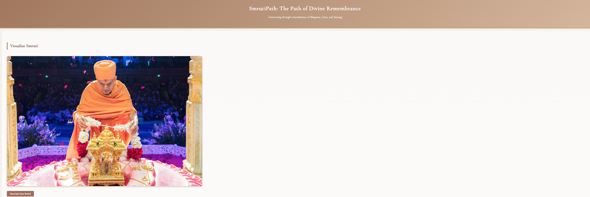

# BAPS Adhiveshan Submission - SmrutiPath

# SmrutiPath - A Journey to Divine Remembrance (Smaranam): 

**SmrutiPath** is a transformative web application designed to deepen your connection with Bhagwan and the Satpurush by bringing your spiritual memories, or **smrutis**, to life. It’s a way to relive cherished moments, reflect on divine experiences, and connect with the teachings of Bhagwan, Maharaj, and our gurus. This platform encourages you to personalize your spiritual journey through reflection, creativity, and deeper introspection.

https://devpatel917.github.io/Adhiveshan/

## 🌟 Why SmrutiPath?

Performing **smruti** is now easier than ever before. In our fast-paced lives, it can be challenging to stay connected to those profound moments of divine connection. SmrutiPath offers a space to:

* Relive your spiritual memories.
* Reflect on divine experiences through various mediums.
* Strengthen your connection with Bhagwan.
* Personalize your spiritual path.

With SmrutiPath, your smrutis are not just memories but living, breathing parts of your spiritual life. It’s a place where you can truly make your smrutis your own.

---

## 📚 Key Features of SmrutiPath

### 1. Visualize Smruti

Enter a world where your smrutis come alive. Here, you are presented with a smruti and can make it uniquely yours by responding to reflection questions. Explore the depths of your spiritual experiences and gain new insights.

* **Generate New Smrutis:** Press a button to unveil fresh smrutis.
* **Custom Reflection Questions:** If you need a different perspective, click 'Generate New Questions' for a fresh set of prompts.

### 2. Divine Connections

Every word in our spiritual journey holds a memory. This section links every **satsang** word to a smruti, creating a web of divine associations.

* **Interactive Word Map:** Click on a word to reveal the smruti it represents.
* **Dynamic Regeneration:** Generate new words to expand your spiritual reflections.

### 3. Read and Reflect

Step into the moment. Here, you read a brief passage from a **prasang** – a moment from the lives of our gurus – and recreate that experience through drawing and reflection.

* **Draw Your Smruti:** Capture what it felt like to be in that divine moment.
* **Regenerate Moments:** Click 'Generate New Prasang' for fresh insights and inspirations.
* **Reflect and Recreate:** Answer tailored reflection questions to deepen your connection.

### 4. Shruti Smruti

Bring the words of the **Satsang Diksha** or **Vachanamrut** to life. Create vivid memories and reinforce your spiritual knowledge.

* **Create Your Own Smruti:** Draw and personalize these sacred references.
* **Generate New References:** Keep your spiritual practice fresh and dynamic.

### 5. Smruti Words

Language is the vessel of culture and memory. In this section, you’ll be presented with a **Gujarati smruti word**, encouraging you to connect with your roots.

* **Draw and Reflect:** Capture the essence of these words through art and introspection.
* **Reinforce Your Spiritual Vocabulary:** Strengthen your connection to your heritage.

---

## 🚀 Why SmrutiPath is Special

* **Personalized Spiritual Journey:** Every feature is designed to make your spiritual path uniquely yours.
* **Creative Reflection:** Use words, drawings, and reflections to capture divine moments.
* **Cultural Connection:** Embrace your roots through the beauty of the Gujarati language.
* **Ever-Evolving Experience:** Generate fresh smrutis, words, and questions as you grow in your faith.

---

## 🎯 Getting Started

Ready to bring your smrutis to life? Visit **[SmrutiPath](https://smrutipath.app)** and start your journey today!

---

## 🙏 Closing Thoughts

These smrutis are yours. Use these features, drawings, reflections, and associations to nurture your spiritual path and bring your divine memories to life.

🕉️ Jay Swaminarayan 🙏
